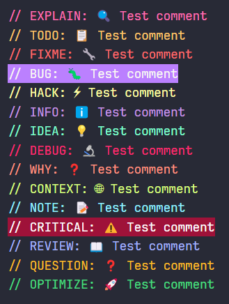

# Better Comment Tags

Enhance your code documentation with semantic comment tags and emojis that make your comments more expressive and easier to find.

## Features

This extension provides a variety of comment tag snippets with emojis for better code documentation and organization:

- **Critical Comments**: Mark important issues that need immediate attention
- **Explanation Comments**: Provide detailed explanations of code functionality
- **Debug Comments**: Highlight debugging information
- **TODO Comments**: Track tasks that need to be completed
- **Note Comments**: Add important notes about your code
- **Section Comments**: Organize your code into logical sections
- **And many more!**

### How to Use

1. Type one of the snippet prefixes (like `todo`, `explain`, `critical`, etc.)
2. Select the snippet from the suggestion list
3. Add your comment text

## Requirements

No additional requirements or dependencies needed.

## Extension Settings

This extension contributes the following settings:

- `better-comment-tags.enabled`: Enable/disable the extension (default: `true`)

## Using the Command

You can apply enhanced comment formatting using the command:

- Open the Command Palette (`Ctrl+Shift+P`)
- Search for "Apply Enhanced Comment Tags"

## Available Comment Tags

| Prefix         | Description          | Tag Format                       |
| -------------- | -------------------- | -------------------------------- |
| `todo`         | Todo items           | `// TODO: 📋 [text]`             |
| `critical`     | Critical issues      | `// CRITICAL: ⚠️ [text]`         |
| `explain`      | Explanation comments | `// EXPLAIN: 🔍 [text]`          |
| `note`         | Important notes      | `// NOTE: 📝 [text]`             |
| `info`         | General information  | `// INFO: ℹ️ [text]`             |
| `idea`         | Improvement ideas    | `// IDEA: 💡 [text]`             |
| `why`          | Explain reasoning    | `// WHY: ❓ [text]`              |
| `debug`        | Debug information    | `// DEBUG: 🔬 [text]`            |
| `sectionstart` | Start a code section | `// NOTE: 📌 section start here` |
| `sectionend`   | End a code section   | `// NOTE: 🏁 section end here`   |

## Release Notes

### 0.0.1

- Initial release
- Added semantic comment tag snippets with emojis
- Command to apply enhanced comment tags

---

**Enjoy better code documentation!**
